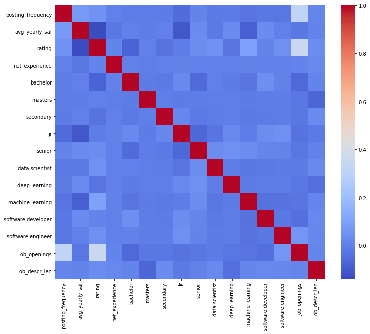

# Salary-Predictor

" 10.8 million and counting: Take a look at how many jobs Covid-19 has wiped out. "

[Read more here]( https://www.moneycontrol.com/news/business/economy/10-8-million-and-counting-take-a-look-at-how-many-jobs-covid-19-has-wiped-out-5704851.html)

The above article is one of many. Covid-19 has impacted our lives greatly but more so has impacted source of income of many, as if things were already not difficult.
As an engineering student currently in my 2nd year, i would be sitting for my internships soon,  it would be great to have an idea what skills are trending in tech industry, to boost my chances of getting good internships and eventually a good job, in this project, I predict salaries based on the skills, company names, requirements and rating of the company posted in indeed ([best job searching site](https://www.thebalancecareers.com/top-best-job-websites-2064080)), for which i scraped the site using [BeautifulSoup](https://www.crummy.com/software/BeautifulSoup/bs4/doc/) library. 

## Table of contents
* [Data Scraping](https://github.com/blaze-fire/Salary-Predictor/blob/main/scraping%20and%20cleaning%20data/indeed_jobs_scraper.py)
* [Data Cleaning](https://github.com/blaze-fire/Salary-Predictor/blob/main/scraping%20and%20cleaning%20data/data_cleaning.py)
* [Observations](#observations)
* [Model Building](#model-building)
* [Results](#results)
	
## Technologies
Project is created with:
* Jupyter notebook version: 6.1.3
* Spyder version:  4.2.1
* Python version: 3.8

## Observations
First, there are a lot of missing values, especially of the target variable<br>
<br>

Lets look at salary distribution<br>
<br>

Lets Look at the correlation b/w some of these these variables<br>
<br>

Some correlations are quite noticable while others are quite weakly related to average salary 

Lets look at average salary vs ratings


## Model Building

**[Python File](https://github.com/blaze-fire/Salary-Predictor/blob/main/model%20building/model.py)**

First started with basic regression models like <b>Lasso</b>  as the data has outliers and lasso is robust to outliers.

Also some really powerful models like <b>Random forest</b>, <b>ExtraTrees</b>, <b>Gradient boosted trees</b> and <b>Xgboost</b> models were used  as the complexity of problem is high but the available data is small. (784 training and 100 test examples) <br>

Also created a blender of best models, to squeeze a bit more performance from the models

*For stacking RandomForest, XGBRegressor, ExtraTrees, GradientBoosting, VotingRegressor were used as they performed the best*

## Results

As the dataset was quite samall, RandomForest was used to generate the feature importances of variables to get an idea of how useful are our variables in predicting target values

Following is the plot for top 10 useful features according to RandomForest
<br>

The features are quite weakly related to the target values.

Lets now look at the performance of various models (Complexity increases down the list)


|Sno.		| Model      				|	Mean Squared Error 		|
| ----		|   :-----------: 			| 		----------- 		|
|	1	| Lasso       		    		|   	719235.0548   			|
|	2	| DecisionTree 				| 	390581.141        		|
|	2	| SVR 					| 	648245.439        		|
|	3	| RandomForest				|   	355811.392   	 		|
|	4	| XGBRegressor  			| 	416166.759        		|
|	5	| ExtraTrees   				| 	438762.352        		|
|	6	| GradientBoosting  			|	498879.956        		|
|	7	| VotingRegressor   			|   	402993.457   			|
|	8	| Stacking Ensemble 			|   	363761.364   			|


**Note:**	*The MSE of all models are on test set.* 

The **R2** score from Stacking Ensemble model predictions is **0.5201**, the model explains half of the observed variation, which is acceptable if not great. (only 784 training and 100 test examples) 
The model can give much better predictions if fed with more data.


To run this project, install it locally using npm:

```
$ cd ../lorem
$ npm install
$ npm start
```
