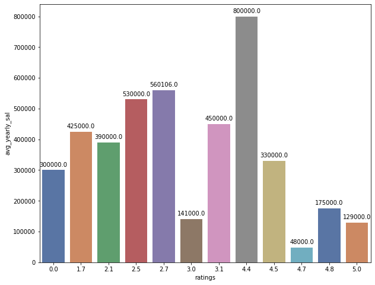
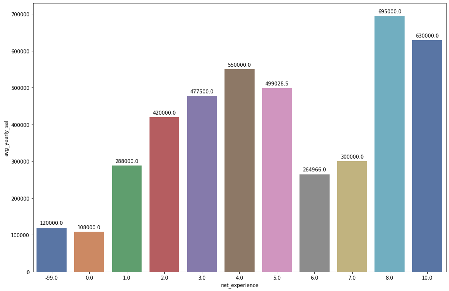
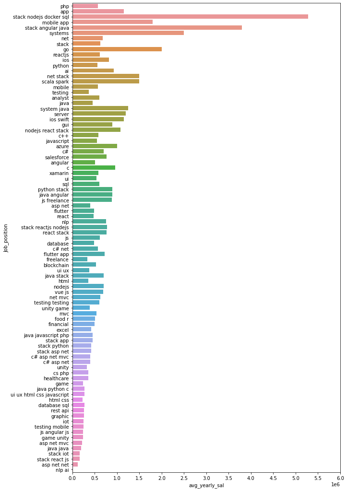
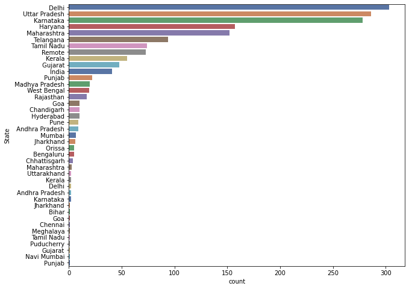

# Salary-Predictor

" 10.8 million and counting: Take a look at how many jobs Covid-19 has wiped out. "

[Read more the article]( https://www.moneycontrol.com/news/business/economy/10-8-million-and-counting-take-a-look-at-how-many-jobs-covid-19-has-wiped-out-5704851.html)

The above article is one of many. Covid-19 has impacted our lives greatly but more so has impacted source of income of many, as if things were already not difficult.
As an engineering student currently in my 2nd year, I would be sitting for my internships soon,  it would be great to have an idea what skills are trending in tech industry, to boost my chances of getting good internships and eventually a good job, in this project, I predict salaries based on the skills, company names, requirements and rating of the company posted in indeed ([best job searching site](https://www.thebalancecareers.com/top-best-job-websites-2064080)), for which I scraped the site using [BeautifulSoup](https://www.crummy.com/software/BeautifulSoup/bs4/doc/) library. 

[App hosted on Heroku](https://salary-predictions-ml.herokuapp.com/)

## Table of contents
* [Data Scraping](https://github.com/blaze-fire/Salary-Predictor/blob/main/scraping%20and%20cleaning%20data/indeed_jobs_scraper.py)
* [Data Cleaning](https://github.com/blaze-fire/Salary-Predictor/blob/main/scraping%20and%20cleaning%20data/data_cleaning.py)
* [Feature Engineering](https://github.com/blaze-fire/Salary-Predictor/blob/main/feature_engineering.ipynb)
* [Observations](#observations)
* [Model Building](#model-building)
* [Results](#results)
	
## Technologies
Project is created with:
* Jupyter notebook version: 6.1.3
* Spyder version:  4.2.1
* Python version: 3.8

## Observations
**[Jupyter Notebook](https://github.com/blaze-fire/Salary-Predictor/blob/main/EDA.ipynb)**

First, there are a lot of missing values, especially of the target variable  
  

Lets look at salary distribution  
  

Lets look at income categories where salaries fall in  
  
Most annual incomes are in the range of 1 to 5 lpa 

As observed from the income category distribution and the avg_annual_sal distribution the salary distribution is really skewed, as most of the people are payed near the average which is pretty low and only a few people get really high salaries 

Lets Look at the correlation b/w some of these these variables  
  

Some correlations are quite noticable while others are quite weakly related to average salary 

Lets look at average salary vs ratings  
  
Higher rated companies generally pay higher with few exceptions (Most of the higher rated companies have not stated the offering salary beforehand, that could be one reason) 

Lets look at average salary vs ratings  
 
Comapanies tend to pay higher to more experienced employees 

We have talked about how various factors relate to annual salary  
Lets now look at most mentioned skills in the requirements section by recruiting companies  
  
From the wordcloud we can see some of the trending skills in software industry 
Looks like most jobs are for front end, most popular framework is .net and the most asked for programming language is python, php and java 

Now lets look at average salary wrt to job role  
  
(i)   Most salaries are below Rs.50000  
(ii)  The highest offered salary is of Rs.5285450 by Jobsrefer  
(iii) A Company even pays an annual salary of just Rs. 6500 !!  

Lets look at states having the highest job openings at the time of data collected  
  
Most job openings are in Karnataka, followed by Delhi  

Lets now look at top 10 companies offering highest salaries wrt seniority  
  
As expected Companies offer high paying salries to senior employees 
Looks like most of the missing job_titles for above companies are probably senior  

## Model Building

**[Python File](https://github.com/blaze-fire/Salary-Predictor/blob/main/model%20building/model.py)**

First started with basic regression models like <b>Lasso</b>  as the data has outliers and lasso is robust to outliers.

Also some really powerful models like <b>Random forest</b>, <b>ExtraTrees</b>, <b>Gradient boosted trees</b> and <b>Xgboost</b> models were used  as the complexity of problem is high but the available data is small. (784 training and 100 test examples)  

Also created a blender of best models, to squeeze a bit more performance from the models

*For stacking RandomForest, XGBRegressor, ExtraTrees, GradientBoosting, VotingRegressor were used as they performed the best*

## Results

To run the notebook unzip the all_models zip in the folder all_trained_models.

As the dataset was quite small, RandomForest was used to generate the feature importances of variables to get an idea of how useful our variables are in predicting target values

Following is the plot for top 10 useful features according to RandomForest
 

The features are quite weakly related to the target values.

Lets now look at the performance of various models (Complexity increases down the list)

|Sno.		| Model      				|	Mean Squared Error 		|
| ----		|   :-----------: 			| 		----------- 		|
|	1	| Lasso       		    		|   	667868.128   			|
|	2	| DecisionTree 				| 	284506.715        		|
|	2	| SVR 					| 	683731.055        		|
|	3	| RandomForest				|   	218930.329   	 		|
|	4	| GradientBoosting 			| 	469119.429     			|
|	5	| ExtraTrees   				| 	318502.193        		|
|	6	| XGBRegressor				|	247804.983     			|
|	7	| VotingRegressor   			|   	290880.830   			|
|	8	| Stacking Ensemble 			|   	241739.189   			|

**Note:**	*The MSE of all models are on test set.*   

For **Stacking Ensemble** : 

The 95% confidence interval for our predictions : [130003.6634 , 302895.4814]

The **R2** score from Stacking Ensemble model predictions is **0.7342**, the model explains about 3/4 th of the observed variation, which is great. The model can give much better predictions if fed with more data.

Also, here our tuned **RandomForest** performs slightly better than our ensemble:

The 95% confidence interval : [113283.578, 288145.465]   
**R2** score : 0.75
